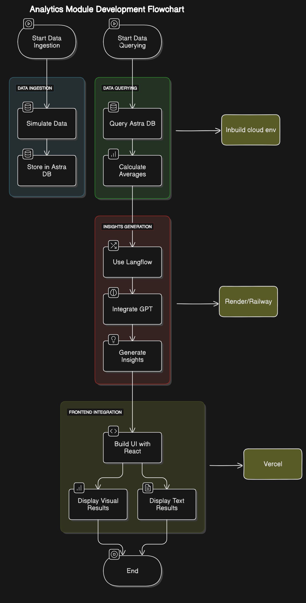
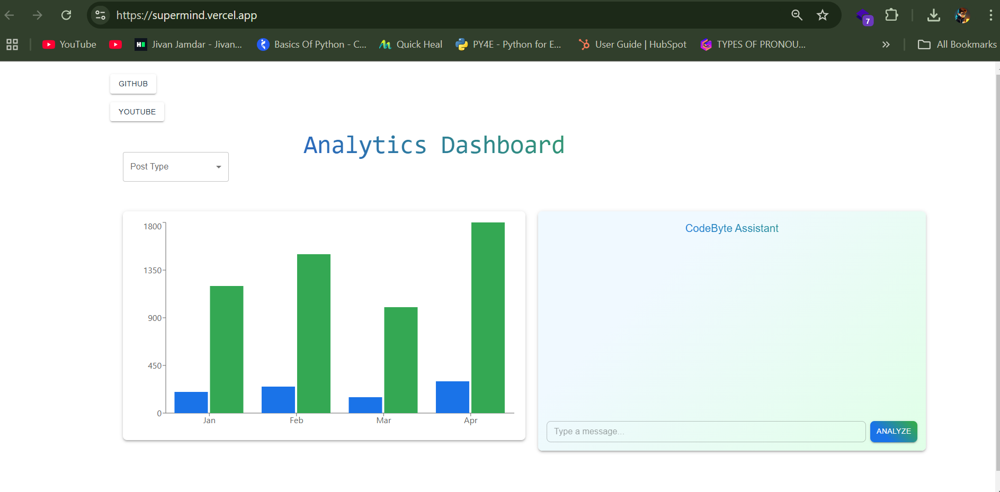
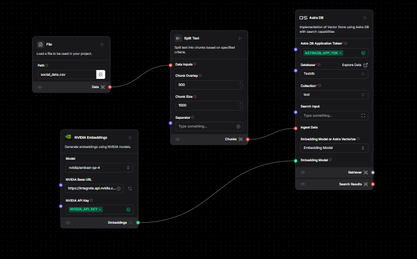
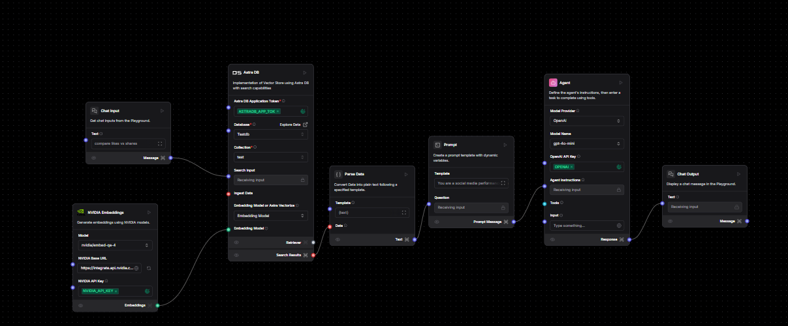
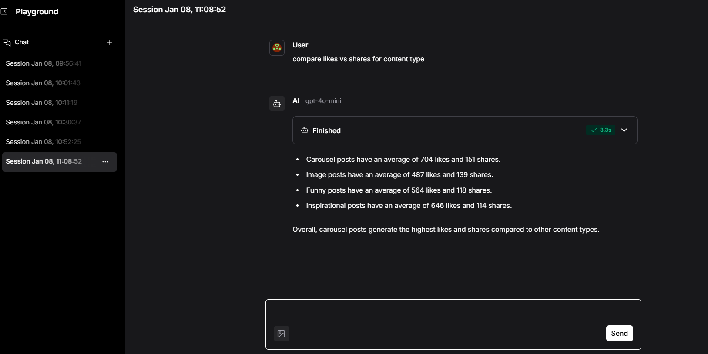
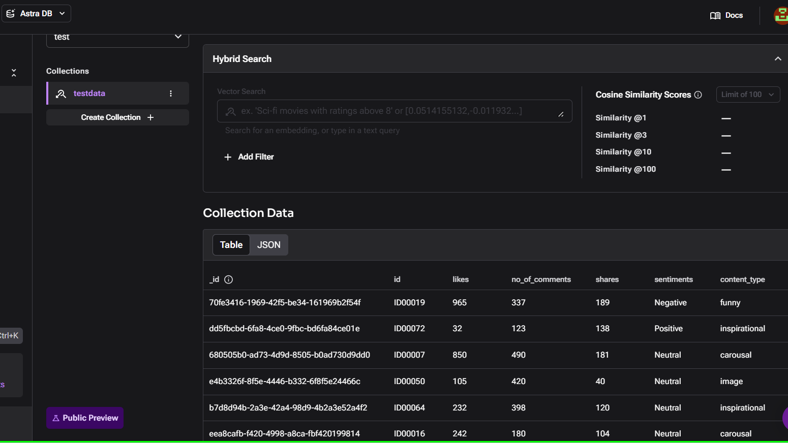

# 📊 Social Media Engagement Analytics Module

## 🌟 Overview

This project provides a **basic analytics module** to analyze social media engagement data, utilizing cutting-edge technologies for seamless workflow creation, database operations, and insights generation.

### ✨ Key Features
- **📥 Data Ingestion**: Store and manage mock social media engagement data in **DataStax Astra DB**.
- **🔍 Data Querying**: Query average engagement metrics (likes, comments, shares) based on post types.
- **📈 Insights Generation**: Leverage **Langflow** and GPT models for actionable insights.
- **📊 Visualization**: Display results using **React** and data visualization libraries like **Chart.js**.
- **💬 Chat Interface**: Enable users to ask questions and view insights via a chatbot interface.

---

## 🛠️ Technologies Used

- **☁️ DataStax Astra DB**: Cloud-based NoSQL database for scalable and efficient data storage.
- **🔗 Langflow**: Workflow tool for creating GPT-based automation and insights generation.
- **⚛️ React**: Frontend framework for user-friendly interfaces.
- **📊 Chart.js**: Library for creating data visualizations.
- **🤖 OpenAI GPT-4 API**: For advanced language understanding and insights generation.

---

## 🧩 Workflow Overview
 

### 🖧 Backend Workflow
1. **📥 Data Ingestion**:
   - Loading of mock engagement data (schema: `ID`, `Post Type`, `Likes`, `Comments`, `Shares`, etc.) into Astra DB.

2. **🔍 Data Querying**:
   - Querying of Astra DB for average engagement metrics based on post types.
   
3. **🤖 Insights Generation**:
   - Processing metrics using **Langflow** workflows integrated with GPT.
   - Generating text-based and graphical responses.

### 🎨 Frontend Workflow

- **📝 Input Form**:
  - Allows users to select post types or ask questions about engagement metrics.
  
- **📊 Results Display**:
  - Display GPT-generated insights (text-based).
  - Visualize engagement data using graphs (e.g., comparisons of likes, shares, comments).

- **💬 Chat Feature**:
  - Enable GPT-driven chat for user queries.
  - Dynamic responses to engagement-related questions.

---

## ⚙️ Implementation Steps

### 1️⃣ Mock Data Creation
- Create a schema: `ID`, `Post Type`, `Likes`, `Comments`, `Shares`.
- Upload the dataset to **DataStax Astra DB**.

### 2️⃣ Backend Development
- **🔗 Langflow Workflow**:
  - Take input from users (e.g., Post Type).
  - Query the Astra DB for data.
  - Process metrics via GPT.
  - Generate actionable insights as output.

### 3️⃣ Frontend Development
- Build the UI with **⚛️ React**:
  - Input form for queries.
  - Visualizations using **📊 Chart.js**.
  - Integration of GPT chat for engagement analysis.

---

## 📷 Screenshots and Diagrams
### 🖥️ User Interface

### 🖥️ Langflow Workflow

### 🗄️ DataStax Astra DB Integration

---

## 🎥 Demo and Resources

- **🌐 Web Application**: [[Link to the Web App](https://supermind.vercel.app/)](#) *(API integration pending)*  
- **🎬 YouTube Walkthrough**: [[YouTube Video](https://youtu.be/N7OWdsmktcg)](#)  
- **👨‍💻 FindCoder Project Link**: [[FindCoder Link](https://www.findcoder.io/projects/social-media-analytics-module/677ea2468015401a988d9768)](#)

---

## 🚀 Future Enhancements
- 🔗 Complete integration of API endpoints with the React frontend.
- 🤖 Enhance chatbot capabilities for more dynamic interactions.
- 📊 Add support for more visualization options (e.g., pie charts, heatmaps).

---
## 🔚 Conclusion

The **Social Media Engagement Analytics Module** demonstrates the power of integrating cutting-edge technologies like **DataStax Astra DB**, **Langflow**, and **OpenAI GPT-4** to analyze, process, and generate actionable insights from social media data. By combining data storage, querying, and advanced AI workflows, this project provides a scalable and efficient solution for understanding audience engagement.

### Key Takeaways:
- **Data-Driven Insights**: The module helps identify trends in social media performance, empowering users to make informed decisions.
- **Scalable Architecture**: Leveraging cloud-based solutions ensures reliability and scalability for large datasets.
- **User-Friendly Interaction**: The chatbot interface and visualization tools provide an intuitive way for users to engage with data.

This project lays the groundwork for future improvements, such as full frontend-backend integration, enhanced visualization, and more robust chatbot interactions. It showcases the potential of AI and cloud technologies in addressing real-world challenges, making it a valuable tool for businesses and individuals seeking to optimize their social media strategies.

---

## 🤝 Contributors
Prepared by **Jivan Jamdar** & Team CodeByte
 
Happy coding...

---

